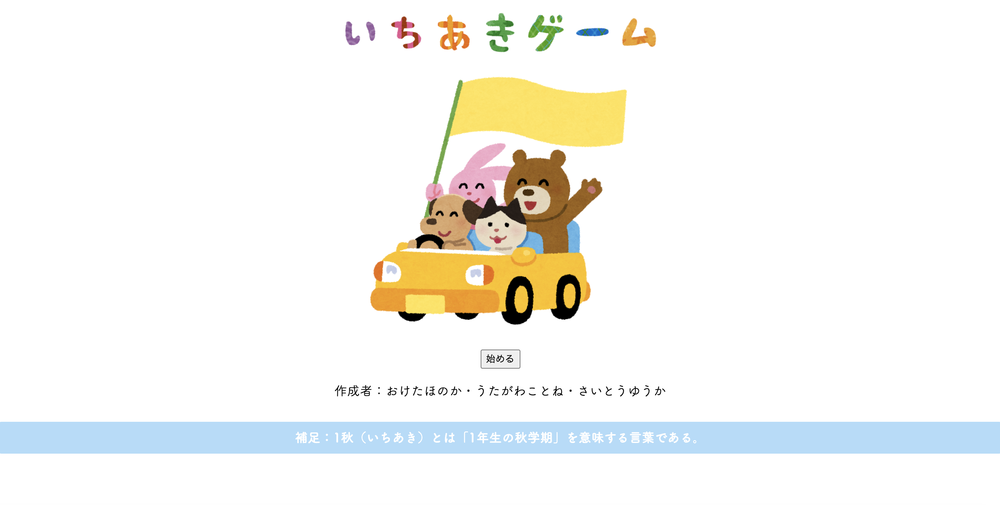

# FIT2
## 2018年度秋学期情報基礎2ミニプロ「1秋ゲームDX」

### メンバー名
桶田穂の香、歌川琴音、斎藤優花

### ★はじめに
私は今回情報基礎2の最終課題であるミニプロで何を製作しようか考えた際、今学期の情報基礎2の授業にて新たに学んだ知識を活かして、1年の春学期情報基礎1最終課題で作った「1春ゲーム」をバージョンアップさせたものを製作したいと考えた。  
歌川琴音さんと斎藤優花さんも同じような目標を持っていたため、各々のページ を繋ぎ合わせて1つの大きなゲームを作ろうという事で、1年の秋学期に焦点を当てた「1秋ゲーム DX」を製作することになった。  
簡単に説明すると、この「1秋ゲーム DX」はSFC生の1年生の秋学期に焦点を当てた人生ゲームのようなものである。  
春学期を経て大分SFC にも慣れてきた頃の今のSFC1年生がもうすぐ終わろうとしている秋学期を振り返ったり、また上級生が1年生の秋学期の頃を懐かしんだりすることができる内容になっている。  
日常生活に疲れた方やくだらないことで笑いたい人にも楽しめる内容になっている。  
ユーザーが「次に何が起こるのだろう。」と次へ次へとページを進めていきたくなるような、暇つぶしに楽しんでもらえるようなシナリオ作りをグループメンバー皆で心がけた。  
1年生の秋学期に特化した内容のゲームにするためにも、多くの人が1年生の秋学期に取るであろう「情報基礎2」に関連したシナリオを作ったり、1年生の秋学期になると感じ始める人が増える「原級の危機」に関連したシナリオを作ったり、また春学期を経たせいか秋学期になってダラけてしまったSFC生に喝を入れるような内容のシナリオを作ったりした。

<a href = "http://web.sfc.keio.ac.jp/~t18173ho/final/final.html">リンクはこちら</a>

 
  
### ★設計
* 複数のHTMLを繋いでストーリーが進んでいく構成。各々が作ったHTMLを繋げていく。
* 各自ゲームの END を用意する。
* END は、情報基礎1最終課題で製作した「1春ゲーム」の時よりも多めな11 個  
(分担内訳は「桶田:4つ」「歌川:5つ」「斎藤:2つ」)  
* JavaScript において配列や繰り返し、条件分岐といった必要条件を満たすと共に、情報基礎2で新たに学んだライブラリ(jQuery)の知識も活かす。
* 桶田はゲームのスタートページから各分岐までのストーリー作り、また「情報基礎最終試験ゲーム」や「猫みくじ」といった小ゲームを担当
* 斎藤はゲームの途中から現れる小ゲームである「トランプゲーム」を担当
* 歌川はゲームの途中から現れる小ゲームである「占いゲーム」を担当

